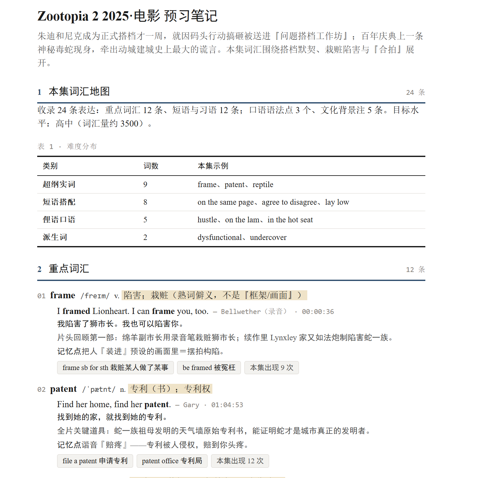

# 美剧英剧字幕 → 英语预习笔记

把美剧/英剧的字幕转成一份**打印友好的 A4 预习笔记**：学习者在看剧之前扫一遍这一集里超出自己水平的词、短语和口语点，看剧时才跟得上。产物是一份可打印的资料，不是交互式背词网页。

## 它做什么

给 AI 一个剧名与季集（或直接给 `.srt` / `.ass` / `.vtt` / `.txt` 字幕文件），它会：

1. 获取并核验该集字幕（剧名季集对应、版本完整、编码正常）
2. 按优先级选词：超纲实词 → 短语搭配 → 俚语口语 → 派生词，共 15–25 条
3. 为每条写结合语境的释义、美式音标、原句、译文、回看时间点
4. 生成自包含 A4 HTML（可直接打印/导出 PDF）+ Markdown 摘要

笔记结构固定为：词汇地图 → 重点词汇 → 短语与习语 → 口语语法点 → 文化背景注 → 自测清单（遮释义回想 + 挖空练习）。

**红线**：检索不到可靠字幕时如实报告，绝不拿记忆里的剧情台词充数——一份编造台词的笔记比没有笔记更糟。

## 项目结构

```
english-subtitle-learning/
├── skill/                          # subtitle-note skill 本体
│   ├── SKILL.md                    # 技能定义（工作流 + 视觉规范）
│   ├── scripts/
│   │   └── build_note.py           # 生成脚本：校验词条 JSON，产出 HTML + MD
│   ├── assets/
│   │   └── note.html               # A4 打印模板（灰度安全，离线可用）
│   ├── references/
│   │   └── data-format.md          # 词条 JSON 字段细节（校验报错时查）
│   └── examples/                   # 演示数据与渲染样张
├── samples/                        # 真实生成样例（见下方示例输出）
├── docs/                           # README 配图 + 设计 Token 预览
├── install.sh / install.ps1 / install.js + package.json   # 一键安装器
├── english-subtitle-to-note-prompt.md   # 纯提示词版，可贴给任何 AI 使用
└── .gitignore
```

## 示例输出



- [《The SpongeBob Movie: Search for SquarePants》(2025) 预习笔记](samples/note-spongebob-movie-2025.html) · 24 条表达 · 字幕由用户提供
- [《Zootopia 2》(2025) 预习笔记](samples/note-zootopia-2-2025.html) · 24 条表达 · 字幕检索自 subtitlecat.com

每份笔记附同名 `.md` 摘要（见 `samples/` 目录）。笔记只收录精选例句，不分发整集字幕。

## 安装

**macOS / Linux（curl 一行装）：**

```bash
curl -fsSL https://raw.githubusercontent.com/Liliane0310/english-subtitle-learning/main/install.sh | bash
```

**Windows（PowerShell 一行装）：**

```powershell
irm https://raw.githubusercontent.com/Liliane0310/english-subtitle-learning/main/install.ps1 | iex
```

**任意平台（有 Node 和 Git 即可，无需发布 npm 包）：**

```bash
npx github:Liliane0310/english-subtitle-learning
```

**手动安装（git clone）：**

```bash
git clone https://github.com/Liliane0310/english-subtitle-learning.git
cd english-subtitle-learning && bash install.sh   # Windows 用 .\install.ps1
```

安装后新开一个会话，对 AI 说"字幕笔记""预习笔记""把这集字幕整理成笔记"等就会触发。

## 默认配置

不为了配置提问，缺项用默认值并在笔记里注明：

| 项 | 默认 |
|---|---|
| 目标水平 | 高中（词汇量约 3500） |
| 收录数量 | 15–25 条表达 |
| 已掌握词表 | 无；用户给了就命中即不收录 |

## 生成链路

词条 JSON 由 AI 按规范直接写入临时文件，`build_note.py` 负责校验并生成：

```bash
python skill/scripts/build_note.py <temp.json> <输出目录>/note-show-S01E01.html
```

脚本会校验必填字段、targets 是否真在原句里、词条是否重复、band 取值，并同时写出同名 `.md` 摘要。仅用 Python 标准库，无额外依赖。

## 字幕来源

- 用户提供文件（首选，支持多集）
- AI 检索：OpenSubtitles、Addic7ed 等字幕站，或 yt-dlp 从视频提取

## 版权说明

本项目仅供学习使用，请尊重版权，支持正版。笔记只收录精选例句，不分发整集字幕。
